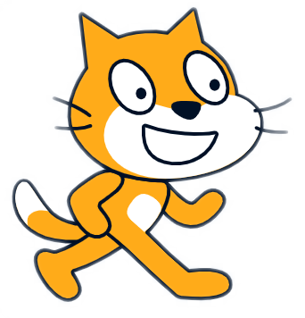

# PenjatHangman
Joc del Penjat - Juego del Ahorcado -  Hangman Game
        <h1>Versió amb Imatges i Sons Joc del Penjat</h1>
        <table>
            <tr>
              <td>
                    <input id="lletra" type="text" 
                           placeholder="Escriu una lletra minúscula" maxlength="1"> 
                    <button id="Comprovar" onclick="Comprovar()">Comprovar</button>
                <h2>Paraula: 
                    <a href="https://www.arabalears.cat/portada/vols-sopes-record-nostres-padrins_129_3048940.html">
                        Demanes sopes?</a></h2>
                    

                        <strong>_ _ _ _ _ _ _</strong>

                <h2>Vides: 
                    <a href="https://pccd.dites.cat/p/Tenir_set_vides%2C_com_els_gats">
                        Tens 7 vides com...</a></h2>
                    

                        <strong>&nbsp;&nbsp;&nbsp;&nbsp;&nbsp;&nbsp;&nbsp;_</strong>

                <h2>Lletres: 
                    <a href="https://pccd.dites.cat/p/De_lletres">
                        Ets de lletres o...</a></h2>
                    

                        <strong>_ _ _ _ _ _ _</strong>

                 
                <strong>URLpistes: 
                    <a href="https://pccd.dites.cat/p/A_la_quinta_forca">Dita 1</a> - 
                    <a href="https://pccd.dites.cat/p/A_ca_un_penjat%2C_no_hi_anomenis_cordes">Dita 2</a> - 
                    <a href="https://pccd.dites.cat/p/Setze_jutges_d%27un_jutjat_mengen_fetge_d%27un_penjat">Dita 3</a>
                </strong>
                 
                
<strong>Crèdits: 
                    <a href="https://prosselloe.wordpress.com/?p=5862">El joc del penjat on Scratch</a>
                </strong>

            </td>
            <td>
                
                
                
                
                
                
                
                
            </td>
          </tr>
        </table>  
        <audio id="mystery">      <source src="public_html/aud/mystery.mp3" type="audio/mpeg"></audio>
        <audio id="clock_ticking"><source src="public_html/aud/clock_ticking.mp3" type="audio/mpeg"></audio>
        <audio id="miau">         <source src="public_html/aud/miau.mp3" type="audio/mpeg"></audio>
        <audio id="cheer">        <source src="public_html/aud/cheer.mp3" type="audio/mpeg"></audio>
        <audio id="boom_cloud">   <source src="public_html/aud/boom_cloud.mp3" type="audio/mpeg"></audio>
        <audio id="bell_toll">    <source src="public_html/aud/bell_toll_x3.mp3" type="audio/mpeg"></audio>
        <audio id="cat-fight">    <source src="public_html/aud/cat-fight.mp3" type="audio/mpeg"></audio>
        

            
            
            
        

        

            
        

        

            
        

